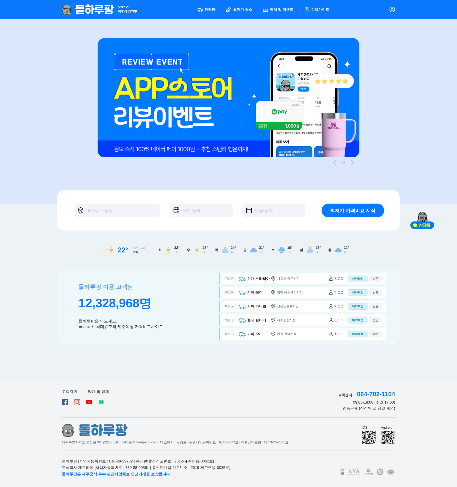

# 돌하루팡 리뉴얼 — 제주 렌트카 가격비교

> **TEAM 카링** · 여행을 좋아하는 I들의 모임
> 제주 렌트카 가격비교 서비스 [돌하루팡](https://www.dolharupang.com/cars)의 화면 구조와 정보 위계를 다시 설계한 UX/UI 리뉴얼 프로젝트입니다.

 

## 1. 프로젝트 소개

여행 서비스를 주제로 정리되지 않은 화면을 찾다가 돌하루팡 제주 렌트카 페이지를 리뉴얼 대상으로 선정했습니다. 이용 고객이 1,200만 명 이상인 서비스지만 첫인상과 정보 구조에는 개선할 부분이 뚜렷했습니다.

**기획 의도**

> 여행 계획의 첫 단계인 렌트카 예약을, 더 넓고 단순하고 믿음직한 화면에서 시작하게 한다.

**현황 분석에서 찾은 문제**

| 문제               | 내용                                                                          |
| ------------------ | ----------------------------------------------------------------------------- |
| 좁은 페이지 폭     | 콘텐츠가 화면 중앙 약 절반에만 몰려 큰 화면에서 정보가 작게 보임              |
| 과밀한 헤더        | 배너, SNS, 아이콘, 로고, 8개 메뉴가 한 영역에 겹쳐 시선이 분산됨              |
| 불분명한 정보 위계 | 검색, 예약 현황, 안내, 후기가 비슷한 무게로 나열됨                            |
| 변하지 않는 화면   | 날짜나 다른 버튼을 눌러도 이미지 영역이 고정되어 어떤 동작이든 같은 느낌을 줌 |

**리뉴얼 방향**

| 영역        | 현재                                        | 리뉴얼                                        |
| ----------- | ------------------------------------------- | --------------------------------------------- |
| 페이지 폭   | 중앙 좁은 단일 컬럼                         | 화면 전체 폭을 쓰는 넓은 레이아웃             |
| 헤더        | 배너·SNS·아이콘·8개 메뉴 혼재               | 로고 + 핵심 메뉴 중심으로 간소화              |
| 페이지 상단 | 같은 이미지가 고정되어 페이지 구분이 어려움 | 페이지마다 제주 사진·제목으로 위치를 분명하게 |
| 검색 영역   | 가격비교 시작 전 단계가 많음                | 날짜·장소 선택을 한 줄 검색바에서 바로 진행   |
| 목록        | 작은 글씨의 표·텍스트 나열                  | 카드형 그리드로 한눈에 비교                   |
| 실시간 정보 | 텍스트 위주로 나열                          | 고객 수·실시간 예약·제주 날씨를 한 영역에     |

 

## 2. 배포 링크와 대표 화면

- **배포 링크**: <!-- TODO: https://(github-id).github.io/(repo-name)/ -->
- **원본 사이트**: https://www.dolharupang.com/cars

**메인 페이지**

<!-- TODO: 렌트카 / 숙소 페이지 캡처를 docs/ 에 추가하고 아래 줄의 주석을 풀어주세요

-->

 

## 3. 팀원과 역할

| 이름   | 역할                                              |
| ------ | ------------------------------------------------- |
| 권지원 | 렌트카 디자인, 회의 담당                          |
| 김미래 | 최저가 숙소 디자인, 전반적인 피그마 디자인 피드백 |
| 김소연 | 헤더와 푸터, 고객서비스 디자인, GIT 담당          |
| 나혜진 | 메인 페이지, 문서 정리 및 PPT 작성                |

 

## 4. 사용 기술

- **HTML / CSS**: 페이지 마크업과 스타일링
- **JavaScript**: 배너 슬라이더, 누적 이용 고객 카운트업, 실시간 예약 목록 롤링, 제주 날씨 표시
- **디자인 · 협업**: Figma, Git / GitHub

 

## 5. 트러블 슈팅

### 권지원 · 카드 화살표를 누르면 같은 줄 카드까지 열리는 문제

**문제**
카드의 화살표를 눌렀는데 같은 줄에 있는 옆 카드까지 함께 열렸습니다.

**원인**
그리드의 기본 정렬값 때문에, 한 카드가 펼쳐지면 같은 줄의 옆 카드도 같은 높이로 늘어났습니다.

**해결**
카드들이 각자 자기 높이만큼만 차지하도록 정렬 방식을 위쪽 기준(`align-items: start`)으로 바꿨습니다.

**결과**
카드가 펼쳐져도 옆 카드는 늘어나지 않습니다.

 

### 김소연 · 다른 페이지에서 헤더와 푸터가 깨져 보이는 문제

**문제**
헤더와 푸터를 공통으로 작업했는데, 다른 팀원의 페이지에서 깨져 보였습니다.

**원인**
공통 작업 중 다른 페이지 작업물들이 함께 커밋되어 파일이 꼬인 것을 확인했습니다.

**해결**
각자 담당한 페이지에는 작업한 헤더와 푸터가 살아 있었습니다. 그래서 메인에 있는 작업물을 브랜치로 받고 다시 올리는 과정을 반복해 바로잡았습니다.

**결과**
모든 페이지의 헤더와 푸터 문제를 해결했습니다.

 

### 나혜진 · 메인 페이지 날씨의 요일과 기온이 오늘과 맞지 않는 문제

**문제**
메인 페이지의 제주 날씨 줄이 항상 같은 요일 순서로 고정되어 있어, 접속한 날이 언제든 화면 속 요일과 기온이 실제 날짜와 맞지 않았습니다.

**원인**
요일 이름과 최고·최저 기온이 값으로 직접 적혀 있었고, 오늘 날짜와 연결된 로직이 없었습니다.

**해결**

- `Date` 객체로 오늘을 기준으로 7일치 요일을 계산해 출력하도록 바꿨습니다. (`getDate() + i`로 월·연도 넘김 자동 처리)
- 기온은 요일별 데이터 배열로 분리해 날짜 순서와 같은 인덱스로 맞췄습니다.
- 무료 날씨 API(Open-Meteo, 키 불필요)로 제주 예보를 받아 오늘부터의 최고·최저 기온을 채우고, 요청이 실패하면 기본값을 보여주도록 했습니다.
- 자정이 지나면 화면을 다시 그리도록 타이머를 추가했습니다.
- 디자인(HTML/CSS)은 그대로 두고 `js/main.js`만 수정했습니다.

**결과**
접속한 날짜부터 요일이 하루씩 이어지고, 각 요일에 맞는 최고·최저 기온이 함께 표시됩니다. 네트워크가 막혀도 빈 화면 없이 기본값으로 표시됩니다.

 

---

_본 저장소는 학습·기획 목적의 팀 프로젝트이며, 원본 서비스의 화면과 캐릭터 저작권은 각 권리자에게 있습니다._
